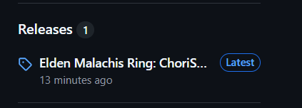
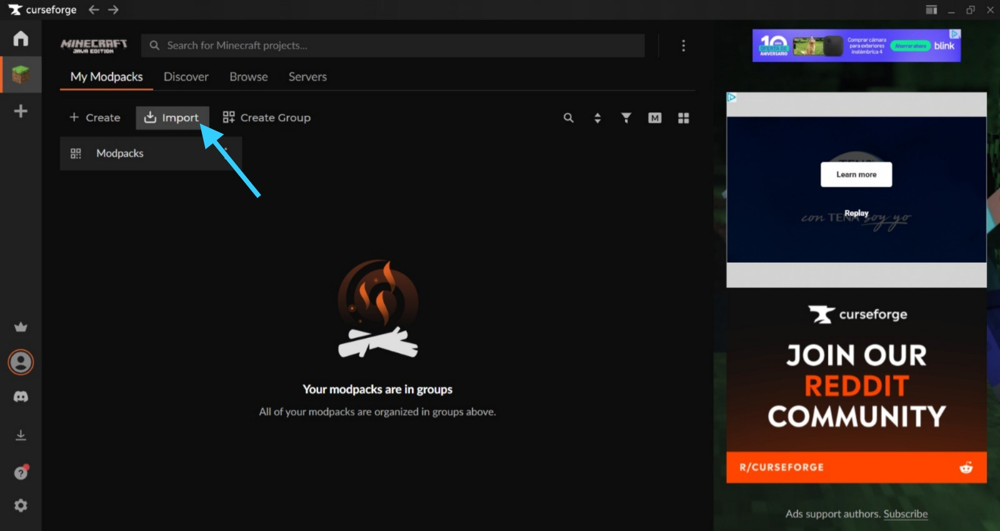
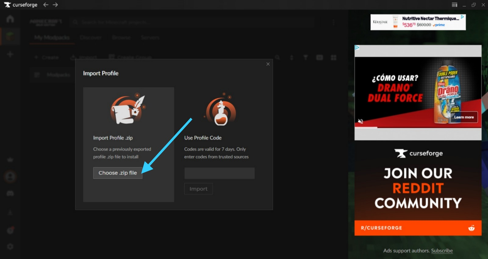
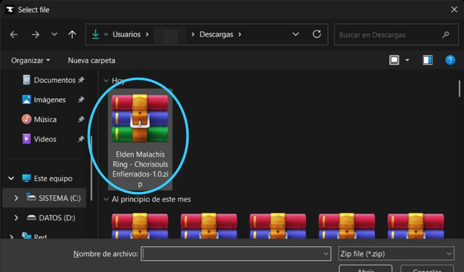
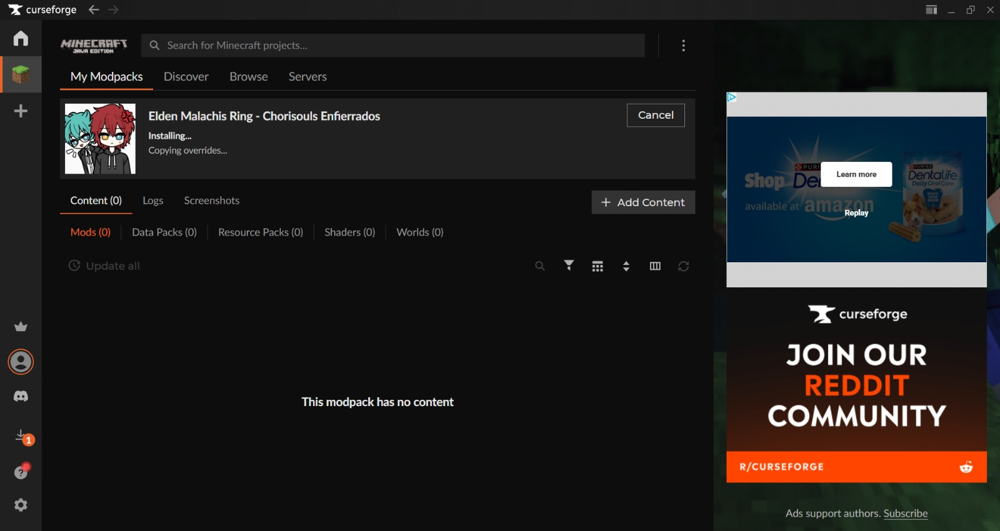
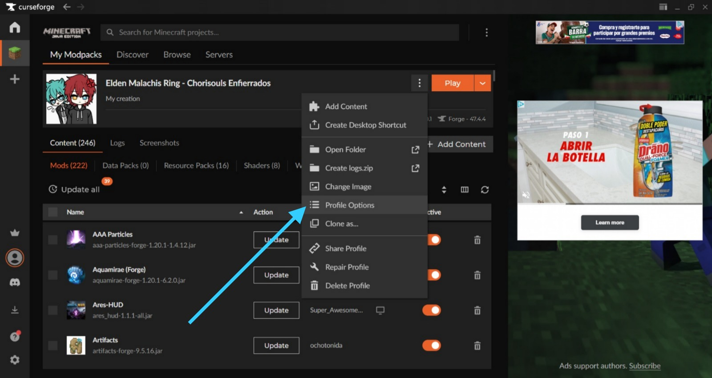
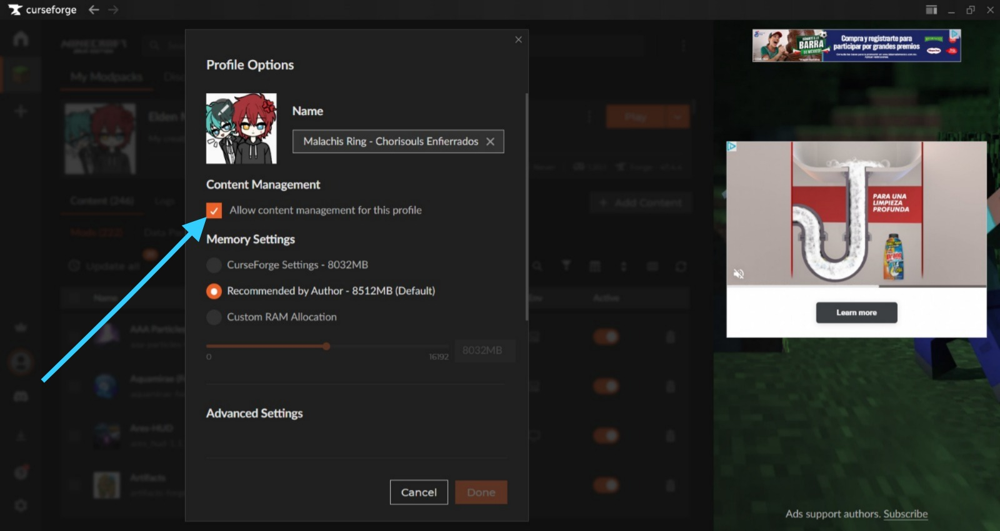
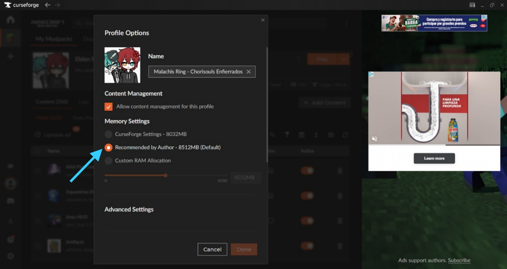

# MALACHIS SAGA 2

---

Los Chorizos Enfierrados presentan:

## ELDEN MALACHIS SOULS: CHORISOULS

Un nuevo servidor para nuestras comunidades ha sido creado con mucho cariño por parte de **YisusGamer79** y **DoorlessCat2835** al puro estilo de los juegos Souls-like y desafiante para que todos disfruten de este mundo maravilloso.

Además, nos hemos tomado el tiempo de programar una moneda exclusiva para el servidor, por lo que ahora será algo sencillo conseguir materiales.

A continuación, les enseñaré cómo instalar dicho perfil para poder jugar en este maravilloso servidor, sin embargo, antes de eso repasaremos las reglas del servidor para una sana convivencia entre todos:

- ### Violencia entre construcciones y destrucción sin razón:

  - **Raideos**: Queda *prohibido* el raideo al servidor usando comandos, construcción de tnt o diferentes maneras de crear destrucción y caos sin sentido por el tal de molestar o inhabilitar el servidor.

  - **PvP**: El *PvP* esta habilitado, sin embargo, para evitar conflictos entre jugadores y toxicidad, no permitiremos violencia sin sentido entre jugadores únicamente porque o la persona te cae mal o solamente quieres generar pelea sin razón aparente. En el caso del *PvP*, se deberá preguntar mediante el chat de voz o el chat de texto si se quiere un *PvP* el cual será _amistoso_ y se deberá realizar con un *árbitro* de intermediante.

  - **Campeo y Rusheo**: Debido a la existencia del mod *TaCZ*, queda *estrictamente prohibido* campear o rushear jugadores solo por el simple hecho de queder matar o cazar a otros jugadores.

  - **Destrucción de clanes y cosntrucciones**: Queda *prohibido* la destrucción de construcciones ajenas a ti sin razón aparente, además, queda *prohibido* igualmente la destrucción de bases de clanes o el clan mismo.

- ### Privacidad del clan:
  
  - **Robar**: No será posible robar a un jugador o a un clan, si el *Staff* o algún *Admin* descubre a alguien robando será castigado gravemente.

  - **Acceso a bases ajenas**: Para acceder a bases ajenas a la tuya, considera pedir invitación a dicho lugar para visitarla y procura no destruir nada.

- ### Alianzas y Clanes:
  
  - **Clanes**: No prohibimos la creación de clanes, al contrario, invitamos a todos a crear uno para formar equipos y apoyarse mutuamente, recuerden que para esto deberán usar el comando: `/ftbteams party create [nombre del clan]`, luego para invitar a gente a su clan utilicen el siguiente comando: `/ftbteams party invite [nombreJugador]` para que dicho jugador abra el chat y haciendo click en `[accept]` forme parte de tu clan.

  - **Alianzas**: Puedes hacer alianzas con cualquier clan que gustes, sin embargo, no es posible crear una alianza para derrotar a un clan, jueguen limpio y recuerden que las alianzas igual sirven para apoyarse mutuamente.

- ### Hacks y X-Ray:
  
  - **Hacks**: A todo aquel que sea atrapado usando *hacks* será brutalmente expuesto y castigado por jugar sucio y será baneado de por vida del servidor.

  - **X-Ray**: A todo aquel descubierto usando *X-Ray* será castigado y baneado del servidor de por vida.

- ### Granjas:
  
  - **Construcción de granjas**: Se permitarán la construcción de granjas siempre y cuando *no generen lag o sobrecarguen chunks o mantengan chunks cargados*, esto es debido a que no queremos un bajón de rendimiento en el servidor que perjudique a todos.

---

# CHORI-MONEDA

Acerca de la **Chori-Moneda**:

- La **Chori-Moneda** fue creada para uso exclusivo en la tienda la cual es accesible en el menú de misiones de *FTBQuests*.

- La **Chori-Moneda** cuenta con varias rarezas:
  
  - **Chori-Moneda L**: La moneda que representa a *Luka Megurine* y perteneciente a *LM_LUKI03*, la cual sirve para la compra de insumos básicos como lo son comida y materiales básicos.

  - La **Chori-Moneda T**: La moneda que representa a *Kasane Teto* y perteneciente a *YisusGamer79*, la cual sirve para la obtención de ciertos minerales de uso cotidiano y algunas armas.

  - La **Chori-Moneda M**: La moneda que representa a *Hatsune Miku* y perteneciente a *DoorlessCat2835*, la cual sirve para conseguir algunas armas del mod de *TaCZ* de manera rápida.

  - La **Chori-Moneda G**: La moneda que representa a *Megpoid Gumi* y perteneciente a *Andreewrld*, la cual sirve para conseguir armas *OP* de manera "temprana", sin embargo, esta moneda suele ser algo complicada de conseguir.

  - La **Chori-Moneda N**: La moneda que represneta a *Akita Neru* y perteneciente a *ZENYHU*, la cual sirve para uso exclusivo de *gambling* y como moneda de pago a eventos organizados dentro del servidor.

Además, existen credenciales los cuales te ayudarán para ciertas *compras* en la tienda de *FTBQuests* y directamente en eventos creados por los *Chorizos Enfierrados*.

> Nosotros no obligamos a nadie a utilizar estas monedas para sus trades con otros jugadores, sin embargo, si ustedes quieren usarlas son bienvenidos. 
>> Recuerden que al ser la moneda oficial de **Chorizos Enfierrados** entonces cualquier trade que se haga con nosotros se les pedirán monedas como moneda de cambio.

---

# ASUNTOS DE CRASHEO EN EL CLIENTE

Optimizamos lo más que pudimos el ModPack pero sin embargo, dentro del mod de TaCZ, uno de sus plugins, en especial el de Helldivers 2, ciertas armas con balas con el efecto de 'explosivo' llegan a crashear el cliente y no se les será posible entrar hasta que el servidor sea reiniciado. A continuación les dejo una lista de dichas armas **baneadas** para su uso por el bien de ustedes:

- **Pistola de Granadas**.

- **Ultimátum**.

- **Cañón Cuásar**.

- **Anti-tanque desechable**.

- **Cañón Automático**.

> El crafteo y usos de estas armas queda a elección de ustedes, si quieren probarlas sabiendo las consecuencias entonces adelante, pero nosotros no nos haremos responsables.

---

# HORARIOS Y DETALLES DEL SERVIDOR

El servidor estará activo **24/7** por lo que pueden entrar a la hora que gusten, sin embargo, a las `4:05 am México` el server siempre será reiniciado para liberar memoria, asi que recomendamos que si se quedan hasta muy tarde tengan esto pendiente para que no se espanten y se salgan con anticipación para evitar problemas.

Pasando a otros temas, el servidor cuenta con un límite de **20 personas** por lo que tomen esto en cuenta para entrar y estén atentos en la cantidad de personas que se encuentren en el server.

IP del servidor (Minecraft Java): `malachissaga2.playminecraft.online`

---

# INSTALAR EL PERFIL EN CURSEFORGE

1. Para instalar el perfil de CurseForge, dirígete al apartado de `Releases` y **únicamente** descarga el archivo llamado `Elden.Malachis.Ring.-.Chorisouls.Enfierrados-1.0.zip` y espera a que se termine la descarga.

2. Teniendo el .zip descargado, dirígete dentro de CurseForge (después de iniciar sesión o haber creado una cuenta) al apartado de `import` dentro del perfil de juego `Minecraft/My Modpacks`.

3. Al hacer click en `import`, les arrojará un menú con dos opciones, se irán a `Import Profile .zip` y hacen click en `Choose a .zip file`.

4. Les abrirá su explorador de archivos, ahi mismo deberán acceder a la carpeta donde se descargó el perfil .zip y lo seleccionan.

5. Una vez sleccionado el perfil, los mandará directo al mismo y justo debajo del nombre les saldrá `Installing...`, solo esperen un ratito y todo estará listo.

6. Teniendo el perfil instalado, recomendamos realizar unos ajustes en el perfil para evitar posibles errores:
- Se dirigirán a los 3 puntitos y al hacerle click se irán a la opción de `Profile Options` para desactivar la opción de *manejar contenido* para evitar problemas de actualizaciones de mods.

7. Deshabilitar la opción de `Allow content management for this profile` y recuerden ajustar la RAM a `8512MB` o mantenerlo en la opción de `Recommended by Author`.

8. (Opcional) Dejamos la imagen por si gustan modificar el valor de RAM del perfil.

---

# DISFRUTEN DE ESTA NUEVA AVENTURA

Para terminar, recuerden que todos los avisos/anuncios se estarán manejando en el canal de [`『🚧』⁜𝓐𝓷𝓷𝓸𝓾𝓷𝓬𝓮𝓶𝓮𝓷𝓽⁜`](https://discord.gg/TRqCKv8g) dentro del servidor de *DoorlessCat2835* [`🐈  𝓜𝓐𝓛𝓐𝓒𝓗𝓘𝓢 𝓕𝓐𝓜𝓘𝓛𝓨  🐈`](https://discord.gg/JcDhfzw6)

Diviértanse y sigan las reglas, les agradezco el tiempo y ¡mucha suerte!.

|

|

|

|

|

|

Los quiere...

_**MALACHIS PRODUCTIONS**_
